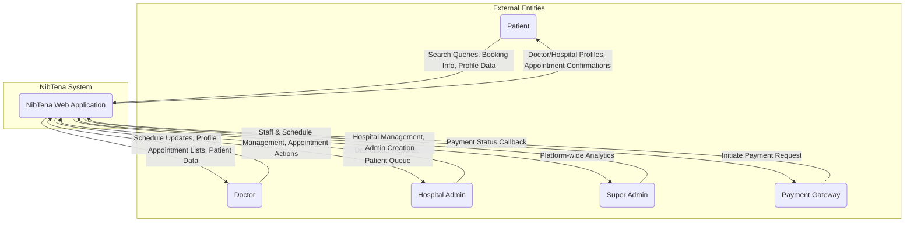

# Data Flow Diagram (DFD) for NibTena

**Version 1.0**

**Date:** 2024-10-26

---

## 1. Introduction

This document illustrates the flow of data within the NibTena system. It provides a visual representation of how data is input, processed, and stored across different parts of the application. The diagrams are created using Mermaid syntax.

## 2. Context Diagram (Level 0 DFD)

The Level 0 DFD shows the entire NibTena system as a single process, illustrating its interaction with external entities.



### Description

-   **External Entities:**
    -   **Patient:** Searches for providers, books appointments, and manages their profile.
    -   **Doctor:** Manages their schedule and views their appointments.
    -   **Hospital Admin:** Manages hospital staff, schedules, and appointments.
    -   **Super Admin:** Oversees the platform, manages hospitals and other administrators.
    -   **Payment Gateway:** An external service that processes appointment fees.
-   **System:** The central **NibTena Web Application** handles all logic, data processing, and user interactions.

## 3. Level 1 DFD

The Level 1 DFD breaks down the NibTena system into its main internal processes and shows how data flows between them and the data stores.

```mermaid
graph TD
    subgraph External Entities
        U[Users (All Roles)]
        PG[Payment Gateway]
    end
    
    subgraph NibTena System
        P1(1.0<br>User & Auth<br>Management)
        P2(2.0<br>Provider & Schedule<br>Management)
        P3(3.0<br>Appointment<br>Booking & Management)
        P4(4.0<br>Reporting &<br>Analytics)

        subgraph Data Stores
            DS1[DS1: Users]
            DS2[DS2: Hospitals & Doctors]
            DS3[DS3: Schedules]
            DS4[DS4: Appointments]
        end
    end

    U -->|Login Credentials, Profile Info| P1
    P1 -->|Session Token| U
    P1 <-->|User & Role Data| DS1
    
    U -->|Provider Profiles, Schedule Edits| P2
    P2 -->|Profile & Schedule Info| U
    P2 <-->|Hospital & Doctor Data| DS2
    P2 <-->|Schedule Rules| DS3

    U -->|Booking Request| P3
    P3 -->|Payment Token| U
    P3 -->|Create Payment| PG
    PG -->|Payment Confirmation| P3
    P3 <-->|Appointment Data| DS4
    P3 -->|Read Schedule| DS3
    P3 -->|Read Provider Info| DS2

    U -->|Report Filters| P4
    P4 -->|Generated Reports| U
    P4 -->|Read Appointments| DS4
    P4 -->|Read Provider Data| DS2
```

### Process Descriptions

-   **1.0 User & Auth Management:** Handles user registration, login (credentials & OTP), session management, and profile updates. It reads from and writes to the **Users** data store.
-   **2.0 Provider & Schedule Management:** Manages the creation and updating of doctor and hospital profiles, as well as doctor schedules. It interacts with the **Hospitals & Doctors** and **Schedules** data stores.
-   **3.0 Appointment Booking & Management:** Handles the entire appointment lifecycle, from searching for slots, initiating payment with the **Payment Gateway**, and confirming bookings. It reads schedule and provider info and writes to the **Appointments** data store.
-   **4.0 Reporting & Analytics:** Generates performance reports and dashboards for hospital admins and super admins by reading from the **Appointments** and **Hospitals & Doctors** data stores.

### Data Stores

-   **DS1: Users:** Stores information for Patients, Super Admins, Hospital Admins, and Staff Users, including credentials and roles. (Corresponds to `Patient`, `SuperAdmin`, `User` tables).
-   **DS2: Hospitals & Doctors:** Contains profile information for all healthcare providers. (Corresponds to `Hospital`, `Doctor` tables).
-   **DS3: Schedules:** Stores the weekly availability and break times for each doctor at each hospital. (Corresponds to `DoctorSchedule` table).
-   **DS4: Appointments:** Holds all data related to booked appointments, including patient info, doctor, status, and transaction details. (Corresponds to `Appointment` table).

## 4. System Boundaries and Security Risks

This section identifies the system's boundaries and highlights potential security risks at key data exchange points.

-   **User Input (All Portals):**
    -   **Boundary:** Browser to Next.js Server Actions/API Routes.
    -   **Risk:** SQL Injection, Cross-Site Scripting (XSS), and invalid data submission.
    -   **Mitigation:** Prisma ORM prevents SQL injection. Zod validation is used in server actions to sanitize and validate all incoming data against a strict schema.

-   **Authentication Endpoints (`/api/auth/...`):**
    -   **Boundary:** Client-side login forms to the NextAuth.js handler.
    -   **Risk:** Credential stuffing, brute-force attacks, and session hijacking.
    -   **Mitigation:** Rate limiting and account lockout mechanisms are implemented for failed login attempts. Sessions are managed with secure, HTTP-only JWTs. A token versioning system ensures sessions can be invalidated server-side.

-   **File Uploads (`/api/upload`):**
    -   **Boundary:** User's machine to the server's file system.
    -   **Risk:** Upload of malicious files (e.g., scripts, executables) disguised as images, leading to RCE or XSS.
    -   **Mitigation:** The upload endpoint performs strict validation on file size, MIME type (using magic bytes), and file extensions. Risky file types like SVG and HTML are explicitly blocked.

-   **Payment Gateway Integration:**
    -   **Boundary:** NibTena system to the external Payment Gateway.
    -   **Risk:** Man-in-the-Middle (MitM) attacks, payment status spoofing.
    -   **Mitigation:** Communication occurs over HTTPS. The callback from the gateway is validated using a secure token in the Authorization header to ensure its authenticity before updating an appointment's status.

-   **Mini-App Connection (`/portal/connect`):**
    -   **Boundary:** External Super App to the NibTena system.
    -   **Risk:** Unauthorized session creation via forged requests.
    -   **Mitigation:** The incoming request must contain a JWT in the Authorization header, which is validated against an external identity provider before a session cookie is created.
