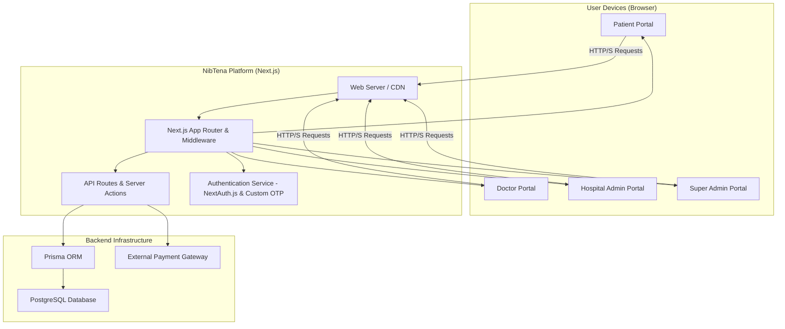
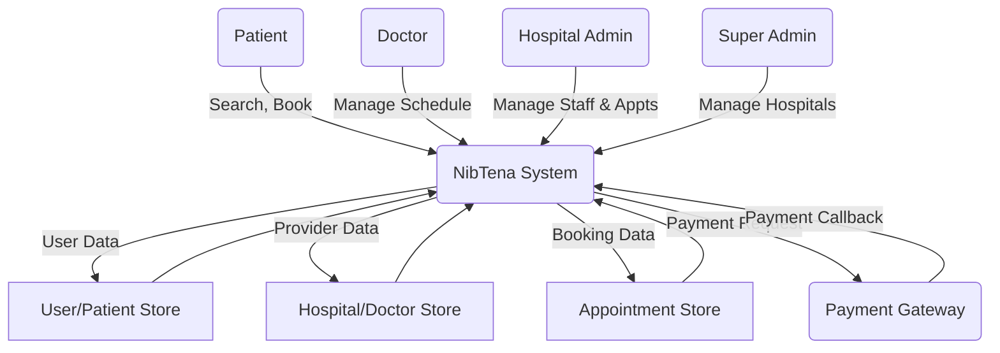
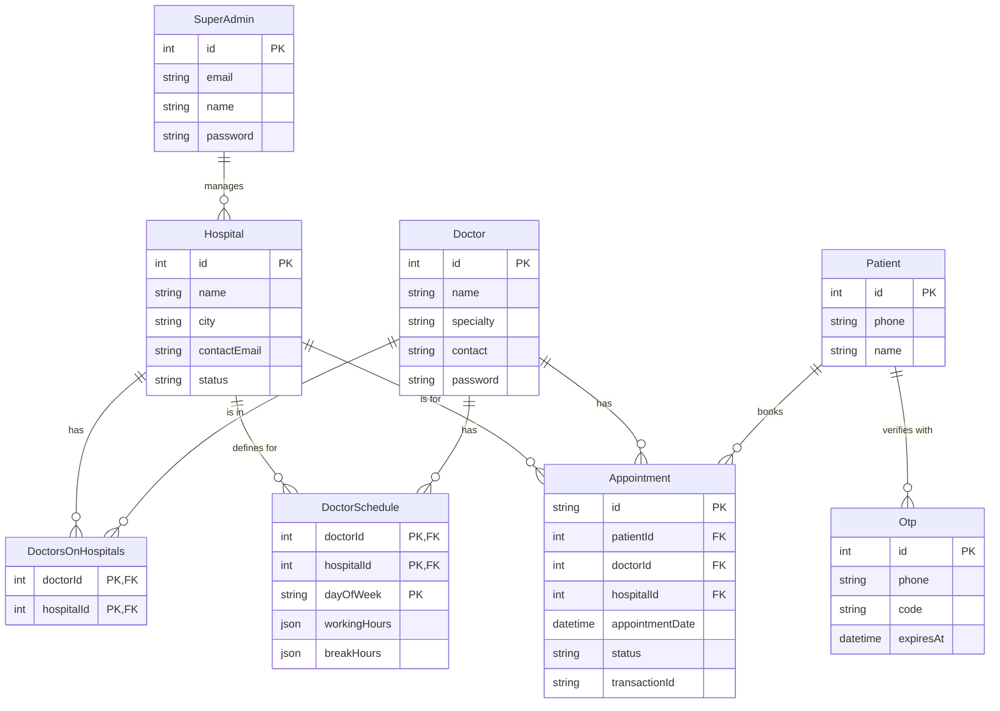

# High-Level Design (HLD) for NibTena

**Version 1.0**

**Date:** 2024-10-26

---

## 1. Introduction

This document outlines the high-level architecture and system design for the NibTena platform. It describes the major components, their interactions, and the overall technology stack, providing a strategic overview for development and implementation.

## 2. System Architecture

The NibTena platform is designed as a monolithic application with a client-server architecture, built using the Next.js framework. This choice allows for Server-Side Rendering (SSR) for performance and SEO, while also enabling a rich client-side experience with React.

### 2.1 Architectural Style

-   **Monolithic Application:** All portals (Patient, Doctor, Hospital, Super Admin) are served from a single Next.js application instance. Role-based access is managed through middleware and route protection.
-   **Component-Based UI:** The frontend is built with React and ShadCN UI components, promoting reusability and a consistent design language.
-   **Serverless Functions:** API routes and server actions within Next.js act as serverless functions, handling data mutations and business logic.

### 2.2 Technology Stack

-   **Frontend:** Next.js (with App Router), React, TypeScript, Tailwind CSS, ShadCN UI, Framer Motion.
-   **Backend:** Next.js (API Routes, Server Actions), Node.js.
-   **Database:** PostgreSQL.
-   **ORM:** Prisma.
-   **Authentication:** NextAuth.js (for credential-based login) and a custom OTP solution (for patient login).
-   **Deployment:** Intended for a cloud platform with serverless function and container support (e.g., Vercel, Firebase App Hosting).

### 2.3 Component Diagram

**Description:**
-   Users access the various portals through their web browser.
-   The Next.js Web Server serves the application pages.
-   The App Router and Middleware handle routing and enforce authentication/authorization rules for each portal.
-   Client-side components make requests to API Routes or invoke Server Actions to interact with the backend.
-   The backend logic uses Prisma to communicate with the PostgreSQL database.
-   The Authentication Service handles all login and session management.
-   For payments, the system communicates with an External Payment Gateway API.

## 3. Data Flow Diagram (DFD - Level 0)

**Description:**
The diagram shows the main external entities (users), the central system process, the primary data stores, and the interaction with the external payment gateway. All user actions flow through the NibTena system, which reads from and writes to its various data stores.

## 4. Database Design

The database will use PostgreSQL, managed via the Prisma ORM. The high-level schema is captured in an Entity-Relationship Diagram.

### 4.1 Entity-Relationship Diagram (ERD)

## 5. Integration Points

-   **Payment Gateway:** The system integrates via a REST API. It sends a POST request to initiate payment and exposes a POST endpoint (`/api/payment/callback`) to receive status updates.
-   **Mini-App (Super App):** Integration is handled via a dedicated GET endpoint (`/portal/connect`) that validates a JWT from the Super App and creates a session cookie. The Mini App client can then communicate with the backend.

## 6. Deployment Strategy

The application is designed for a serverless deployment model.
-   **Hosting:** A platform like Firebase App Hosting or Vercel.
-   **Database:** A managed PostgreSQL provider (e.g., Supabase, Neon, AWS RDS).
-   **CI/CD:** A CI/CD pipeline will be set up to automatically build, test, and deploy the application upon pushes to the main branch.
-   **Environment Variables:** All sensitive information (database URLs, API keys) will be managed through environment variables (`.env`).
