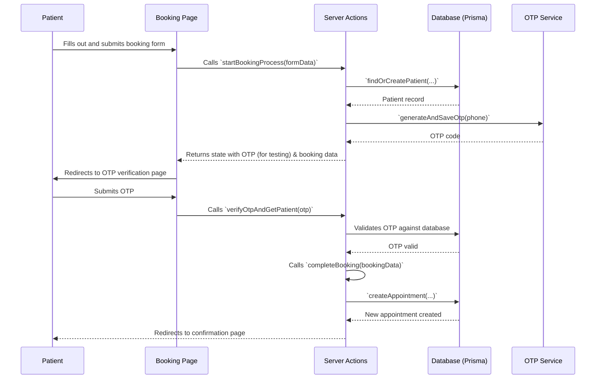
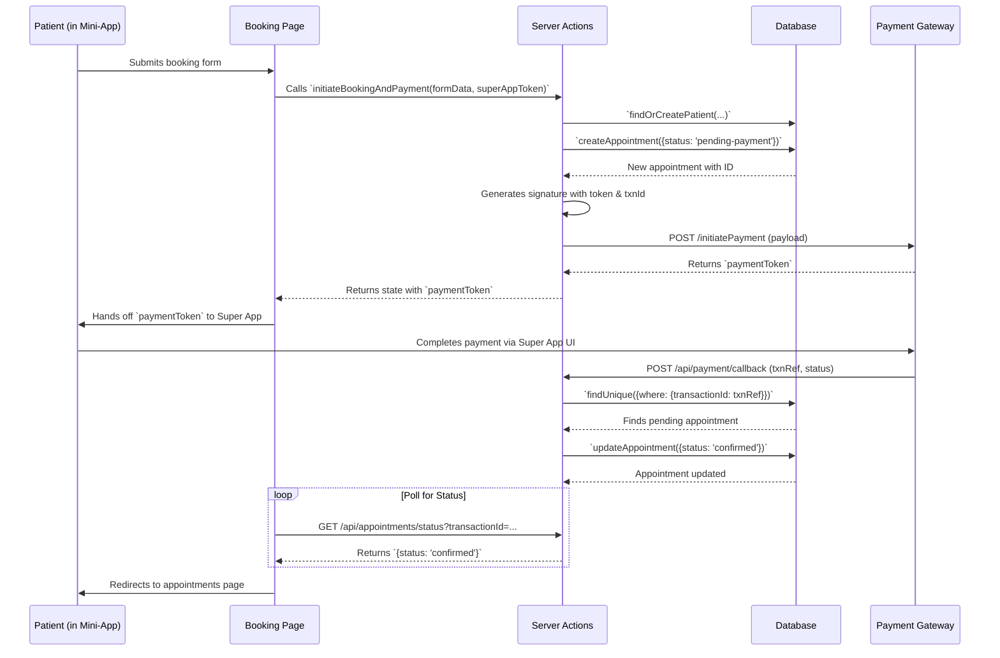

# Low-Level Design (LLD) for NibTena

**Version 1.0**

**Date:** 2024-10-26

---

## 1. Introduction

This document provides a detailed, low-level design of the modules and components within the NibTena system. It elaborates on the HLD by detailing class structures, function signatures, UI layouts, and specific logic flows.

## 2. Module Design

### 2.1 `src/app/(portals)` - UI & Page Modules

Each user portal is structured using Next.js App Router conventions.

-   `/user`: Patient-facing pages.
    -   `page.tsx`: Homepage with search and navigation.
    -   `doctors/[id]/page.tsx`: Doctor profile and booking interface.
    -   `appointments/page.tsx`: Patient's appointment history.
-   `/doctor-portal`: Doctor-facing pages.
    -   `layout.tsx`: Provides the main sidebar and header for the portal.
    -   `page.tsx`: Doctor's dashboard.
    -   `schedule/page.tsx`: Interface for managing weekly schedules.
-   `/hospital-admin`: Hospital admin pages.
    -   `doctors/page.tsx`: CRUD interface for managing doctors.
    -   `queue/page.tsx`: Live patient queue management for the day.
-   `/super-admin`: Super admin pages.
    -   `hospitals/page.tsx`: CRUD interface for managing hospitals.

### 2.2 `src/lib` & `src/actions` - Core Logic

-   **`src/lib/prisma.ts`**: Exports a singleton instance of the Prisma client for database access.
-   **`auth.ts`**: Configures NextAuth.js. It defines the `Credentials` provider, authorizes users by checking their role and credentials against the database, and manages JWT/session callbacks to include role information.
-   **`src/app/.../actions.ts`**: Contains all Next.js Server Actions. These are server-side functions that can be called directly from client components.
    -   **`saveAppointment(...)`**: Handles the logic for creating or updating an appointment, including validation against doctor schedules.
    -   **`saveDoctor(...)`**: Creates or updates a doctor's profile, including password hashing and image uploads.
    -   **`updateHospitalStatus(...)`**: Toggles the 'active'/'inactive' status of a hospital.

### 2.3 `src/components` - Reusable UI Components

-   **`/ui`**: Contains base UI components from ShadCN (Button, Card, Input, etc.).
-   **`/hospital-admin`**: Components specific to the Hospital Admin portal.
    -   `appointment-form-drawer.tsx`: A slide-out panel containing the form to add or edit appointments.
    -   `doctor-list.tsx`: The table/list view for displaying doctors.
-   **`/patient-portal`**: Components for the patient experience.
    -   `appointment-card.tsx`: Displays a summary of a single patient appointment.

## 3. Detailed Logic Flow (Sequence Diagrams)

### 3.1 Patient Appointment Booking (Standalone Web)

### 3.2 Mini-App Payment & Booking Flow

## 4. API Endpoint Specification

| Endpoint                      | Method | Description                                                                | Request Body/Params             | Response                                    |
| ----------------------------- | ------ | -------------------------------------------------------------------------- | ------------------------------- | ------------------------------------------- |
| `/api/auth/[...nextauth]`       | GET/POST | Handles all NextAuth.js authentication flows (login, logout, session).   | Varies (credentials, etc.)      | Session data or redirect.                   |
| `/api/payment/callback`         | POST   | Webhook for the payment gateway to confirm a successful transaction.       | `{txnRef, paidAmount, ...}`     | `{ message: "Payment confirmed." }`         |
| `/api/appointments/status`    | GET    | Checks the current status of an appointment during the payment process.    | `?transactionId=<uuid>`         | `{ status: "pending-payment" / "confirmed" }` |
| `/api/doctor-data`              | GET    | Fetches detailed information for a single doctor, including hospitals.   | `?id=<doctorId>`                | `{ doctor, doctorHospitals }`               |
| `/api/uploads`                | POST   | Handles file uploads and saves them to the server.                         | `FormData` with a `file` field. | `{ success, url, filename, ... }`           |
| `/api/uploads/[filename]`     | GET    | Serves a previously uploaded image file.                                   | `[filename]` in URL path.       | The image file with correct content-type.   |

## 5. Security and Testing

### 5.1 Security Measures
-   **Authentication:** `next-auth` middleware protects all sensitive routes. The `authorized` callback in `auth.ts` contains the logic for role-based access control.
-   **Input Validation:** `zod` is used in all Server Actions to validate incoming `FormData`, preventing invalid or malicious data from being processed.
-   **Database Security:** Prisma helps prevent SQL injection by parameterizing queries. Access to the database is restricted to the application server.
-   **File Uploads:** The `/api/upload` route validates file types and sizes to prevent abuse. Filenames are sanitized to prevent directory traversal attacks.

### 5.2 Testing Strategy
-   **Unit Tests:** Server Actions and utility functions will be tested in isolation using a framework like Jest.
-   **Integration Tests:** Test the interaction between components, Server Actions, and the database. This can be done by setting up a test database.
-   **End-to-End (E2E) Tests:** Use a tool like Playwright or Cypress to simulate user flows across the different portals (e.g., a patient books an appointment, and it appears in the doctor's portal).

---
